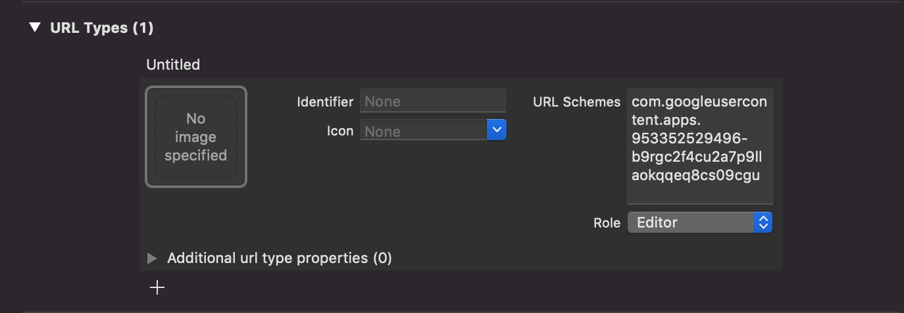
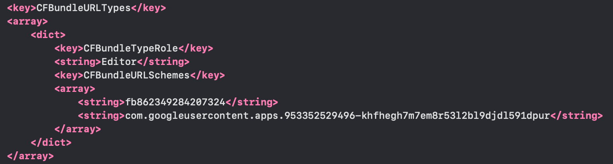
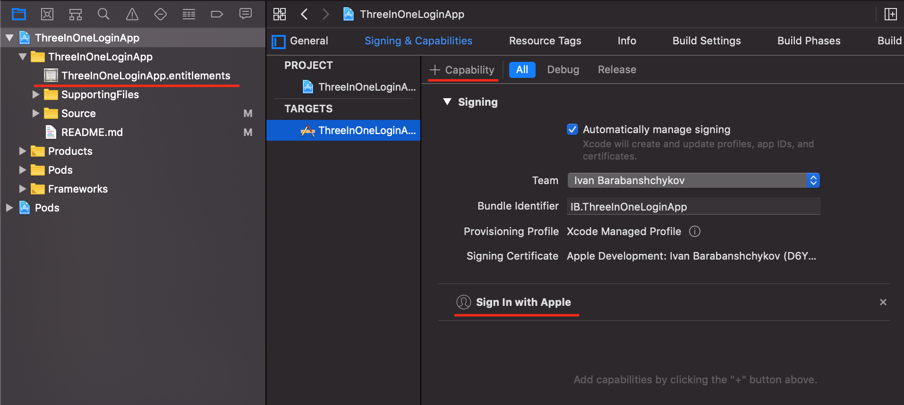

#  Three In One Login App

To implement, first of all, you need to set up your CocoaPods dependencies.
Add the following to your Podfile:
```
pod 'GoogleSignIn'
pod 'FBSDKLoginKit'
```
Save the file and run:
```
pod install
```
### Now let's start with Google auth:

• Get an OAuth client ID for Google sign in:

Go to https://developers.google.com/identity/sign-in/ios/start-integrating
Click on "Create an OAuth client ID"
After creating client ID, save configuration file, which contains your client ID and other configuration data, for future reference.

• Add a URL scheme to your project

Google Sign-in requires a custom URL Scheme to be added to your project. To add the custom scheme:

1. Open your project configuration: double-click the project name in the left tree view. Select your app from the TARGETS section, then select the Info tab, and expand the URL Types section.

2. Click the + button, and add your reversed client ID as a URL scheme.

The reversed client ID is your client ID with the order of the dot-delimited fields reversed. You can copy it from the configuration file, that you downloaded before.

When completed, your config should look something similar to the following (but with your application-specific values):



Then open AppDelegate file and import GoogleSignIn library:

```
import GoogleSignIn
```

Configure the GIDSignIn shared instance and set the sign-in delegate in application(_:didFinishLaunchingWithOptions:) method:

```
GIDSignIn.sharedInstance().clientID = YourClientID
```

And add this method to handle authentitication url:

```
func application(_ app: UIApplication, open url: URL, options: [UIApplication.OpenURLOptionsKey : Any]) -> Bool {
return GIDSignIn.sharedInstance().handle(url)
}
```

### Now let's setup Facebook Auth:

• Register and Configure Your App with Facebook:

Go to https://developers.facebook.com/docs/facebook-login/ios/
And click "Create a New App" in step 1 to get your App ID.
Skip step 2 (we already added dependencies to our project)

In step 3, just select your bundle ID, If the box is empty, find your bundle identifier in your Xcode Project's iOS Application Target and paste it into the box below.
And in 3b turn on "Enable Single Sign On"

Now proceed to step 4, read and follow instructions. Facebook generates snippets and you just need to copy it to your info.plist file(Right-click and choose Open As Source Code.). Watch out you already have "CFBundleURLSchemes" in your info.plist file, dont override you google URL scheme just place it near like this:



Don't miss 4b step:
Go to the Project Navigator in Xcode and select your project to see project settings.
Select Other Linker Flags for editing.
Add the flag -ObjC to Other Linker Flags for all build targets.

Now lets go to AppDelegate file and import GoogleSignIn library:
```
import FacebookCore
```
Add this line in application(_:didFinishLaunchingWithOptions:) method:
```
ApplicationDelegate.shared.application(application, didFinishLaunchingWithOptions: launchOptions)
```
And modify return option to handle authentitication url:
```
func application(_ app: UIApplication, open url: URL, options: [UIApplication.OpenURLOptionsKey : Any]) -> Bool {
    if ApplicationDelegate.shared.application(app, open: url, options: options) {
        return true
    } else if GIDSignIn.sharedInstance().handle(url) {
        return true
    }
    return false
}
```

### Apple Sign In (required Xcode 11, iOS 13)

This one is piece of cake, just follow instructions:

• Project Navigator→ Select Project → Select Target.
• In Project Editor, Click Signing & Capabilities.
• Add Capability by clicking the + button. Search for Sign In with Apple Capability in Capability Library.
• Double-click the capability to add.



Entintlements file must have been created. If not you will need to use Certificates, Identifiers & Profiles and add capability manualy in your apple developer account.

That's all setups you need, now you can go throuth this project and copy all files you need. That will be all files in "Services" folder and "Models". Look into AppCoorfinator and controllers to see how AuthHelper works.

### Important note about Apple Sign In
Apple ID Credentials with email and name of the user will be received only once when signing up! So you better think about saving it beforehand!
